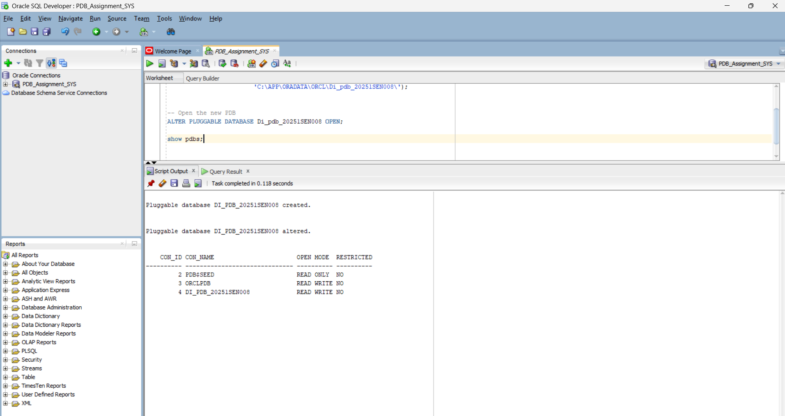
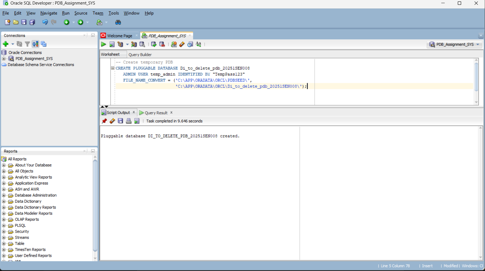
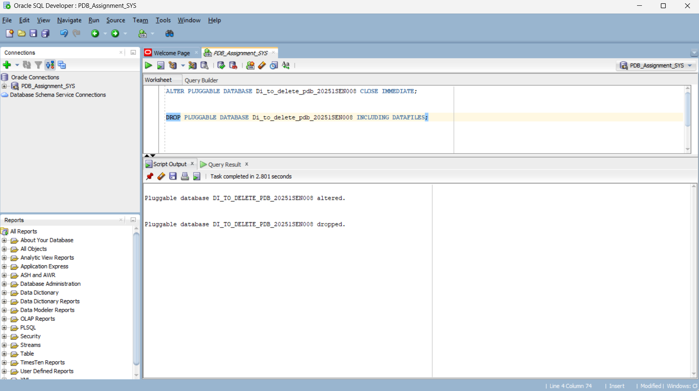
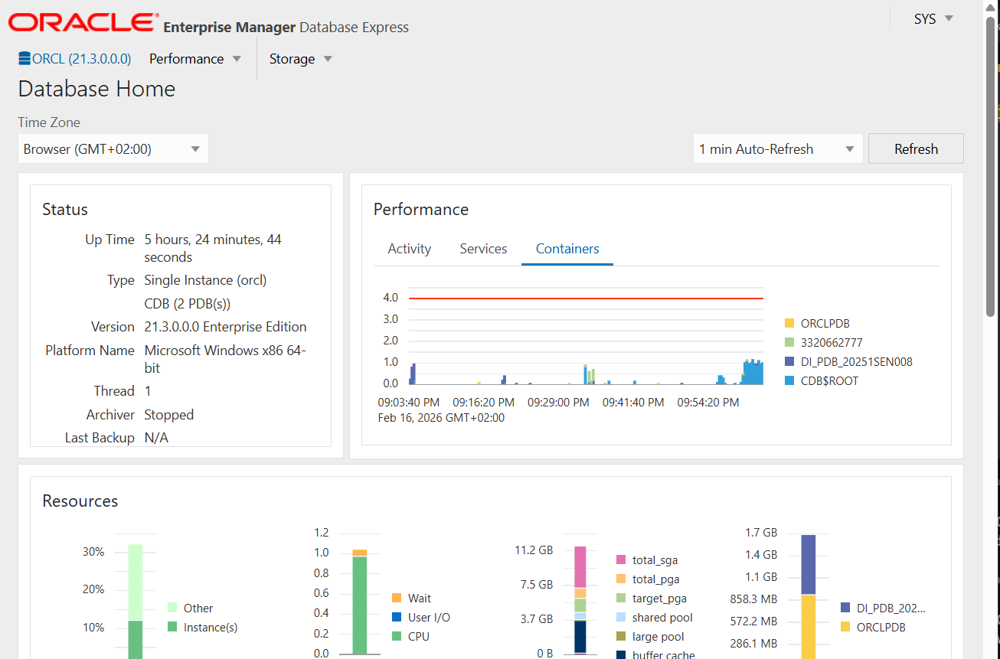

# Oracle Pluggable Databases Management

**Individual Assignment II – INSY 8311**

---

## Overview

This assignment demonstrates practical skills in Oracle Multitenant Architecture, including creation and management of Pluggable Databases (PDBs), user administration inside a PDB, and system monitoring using Oracle Enterprise Manager (OEM).

---

## Environment Used

- **Database:** Oracle Database 21c
- **Tool:** Oracle SQL Developer
- **Architecture:** Multitenant (CDB & PDB)

---

## Task 1 – Creation of Main Pluggable Database

A new Pluggable Database (PDB) was created following the required naming convention.

**PDB Name:**  
`Di_pdb_20251SEN008`

Steps performed:

- Connected as SYSDBA
- Verified container (CDB$ROOT)
- Created the Pluggable Database
- Opened the PDB
- Verified READ WRITE open mode
- Saved the open state
- Switched session to the PDB
- Created a local user inside the PDB
- Granted privileges
- Verified user creation

**Username Created:**  
`diane_plsqlauca_20251SEN008`

### Evidence

**PDB Creation**  

**PDB Open State**  

**User Created Inside PDB**  

---

## Task 2 – Temporary PDB Creation & Deletion

A temporary Pluggable Database was created and later deleted.

**Temporary PDB Name:**  
`Di_to_delete_pdb_20251SEN008`

Steps performed:

- Created temporary PDB
- Verified existence
- Closed temporary PDB
- Dropped PDB including datafiles
- Confirmed deletion

### Evidence

**Temporary PDB Creation**  

**Temporary PDB Deletion**  

---

## Task 3 – Oracle Enterprise Manager (OEM)

Oracle Enterprise Manager (OEM) was successfully accessed via browser.

Verification performed:

- OEM dashboard accessibility
- Database environment visibility
- Pluggable Databases visibility

### Evidence

**OEM Dashboard**  

---

## Challenges Encountered

Problem: Invalid Container Name error during OEM login.

Cause: Attempted login using CDB$ROOT and incorrect container naming/case.

Solution: Verified containers with SHOW PDBS, ensured PDB was OPEN, and logged in using the exact PDB name and admin user.

## Conclusion

This assignment provided hands-on experience with Oracle Multitenant Architecture, including PDB creation, management, deletion, and monitoring using OEM.

---

## Academic Integrity Statement

I confirm that this assignment was completed individually.  
All commands were executed by me, and all screenshots represent my own work.

---

**Student Name:** Diane INGABIRE RUTAGENGWA  
**Student ID:** 20251SEN008
